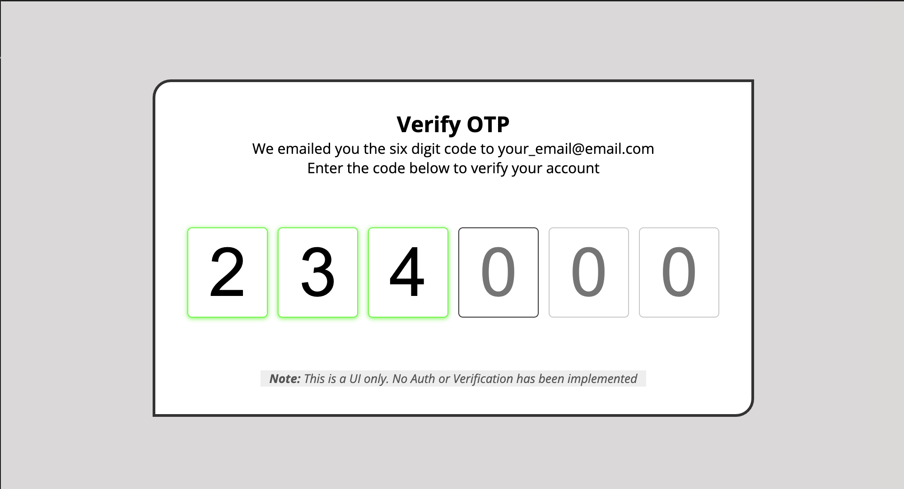

# OTP Input UI 


A sleek and responsive One-Time Password (OTP) input interface built with HTML, CSS, and JavaScript. This UI provides an intuitive and visually appealing way to enter OTP codes, commonly used in authentication systems. With smooth focus transitions and validation feedback, this project is a perfect starting point for implementing OTP input fields in web applications.

## Key Features
- **Smooth Focus Transition**: Automatically moves focus to the next input box for seamless entry.
- **Keyboard Navigation**: Supports numeric input and backspace for corrections.
- **Responsive Design**: Fully responsive layout optimized for desktop and mobile devices.
- **Validation Feedback**: Displays visual feedback for valid input fields.
- **Pure UI Implementation**: Note: This project is a frontend-only UI without backend authentication or verification.

## Technologies Used
- **Frontend**: HTML, CSS (with responsive and accessible design principles).
- **JavaScript**: Manages focus transitions and user interactions.

## How to Run
1. Clone the repository:
   ```bash
   git clone https://github.com/yourusername/OTP-Input-UI.git
   cd OTP-Input-UI
   ```
2. Open `index.html` in your browser to explore the OTP input interface.

## Live Demo
Check out the live [ Demo ](https://chrisroland.github.io/OTP-Input-UI/)

## Contributions
- Feel free to **open issues** for bugs or feature requests.
- **Pull requests** are welcome for enhancements or new features.
- This project is **open-sourced**, and I encourage **constructive feedback** and **collaborations**!

Thank you for checking out this project! ❤️